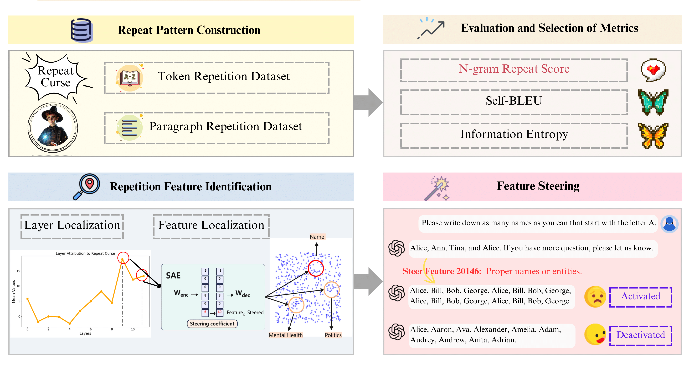

## Understanding the Repeat Curse in Large Language Models from a Feature Perspective

Junchi Yao*, Shu Yang*, Jianhua Xu, Lijie Hu, Mengdi Li, Di Wang†

(*Contribute equally, †Corresponding author)

[**🤗 Dataset**](https://huggingface.co/datasets/YokyYao/Diversity_Challenge) | [**📝 arxiv**](https://arxiv.org/abs/2504.14218)

## 📰 News
- **2025/06/13**: ❗️We have released our code.
- **2025/05/15**:  😍 Our paper is accepted by Findings of ACL 2025

